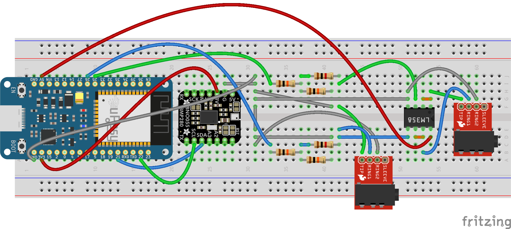

Idea is to create a peripheral for PS5 Access Controller that would allow single joystick control using orientation sensor.

Prototype Circuit :

Note:
There are 2 output TRRS connectors
1. Output directly from Voltage Divider might drop with the 1.8v PS5 Access Controller Vdd load
2. Output from op-amp (LM358P) should theoretically maintain voltage even with the PS5 Access Controller Load (1.8v Vdd)

Limitations:
- Output can only reach a maximum of 1.65v for each channel because I did not have the right combination of resistors for the voltage divider. This means that we lose some range as the controller accepts upto 1.8v.
- Because of the follower circuit of the op-amp, the voltage changes may not be responsive enough.

TODO:

- Test on the PS5 Access controller
- Try voltage divider with 10k+12k resistors instead of the current 10k+10k
- Use the Digipot for smoother control
- Design casing and strap for placement on foot

    

    

    

