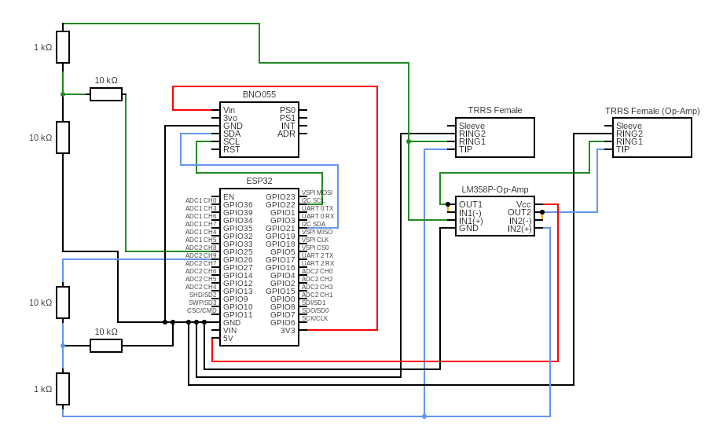
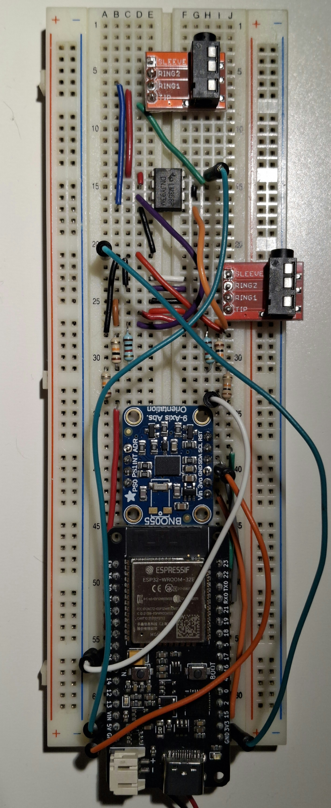

Idea is to create a peripheral for PS5 Access Controller that would allow single joystick control using orientation sensor.

Necessary Hardware :

- Dual digital potentiometer
- 3.5mm TRRS male to male cable
- 3.5 mm TRRS female to bare cable adapter
- Orientation sensor
- Microcontroller

Purchase links (excluding microcontroller & sensor) :

- https://fr.farnell.com/en-FR/microchip/mcp4251-103e-p/ic-dpot-5-5v-10kr-14-pdip-spi/dp/1578442
- https://fr.aliexpress.com/item/1005009181119614.html?spm=a2g0o.productlist.main.5.527d265fZ5d7Yj&algo_pvid=d3ab633c-299e-44ca-9e2f-9e41af100021&algo_exp_id=d3ab633c-299e-44ca-9e2f-9e41af100021-4&pdp_ext_f=%7B%22order%22%3A%22487%22%2C%22spu_best_type%22%3A%22service%22%2C%22eval%22%3A%221%22%2C%22fromPage%22%3A%22search%22%7D&pdp_npi=6%40dis%21EUR%212.15%210.99%21%21%212.47%211.14%21%402103894417674752528995889e14cc%2112000048218150272%21sea%21FR%210%21ABX%211%210%21n_tag%3A-29910%3Bd%3A71900768%3Bm03_new_user%3A-29895%3BpisId%3A5000000187630341&curPageLogUid=51z32Wq2IaMw&utparam-url=scene%3Asearch%7Cquery_from%3A%7Cx_object_id%3A1005009181119614%7C_p_origin_prod%3A
- https://fr.aliexpress.com/item/1005008510930978.html?spm=a2g0o.productlist.main.47.527d265fZ5d7Yj&algo_pvid=d3ab633c-299e-44ca-9e2f-9e41af100021&algo_exp_id=d3ab633c-299e-44ca-9e2f-9e41af100021-46&pdp_ext_f=%7B%22order%22%3A%2241%22%2C%22eval%22%3A%221%22%2C%22fromPage%22%3A%22search%22%7D&pdp_npi=6%40dis%21EUR%212.34%212.35%21%21%212.69%212.69%21%402103894417674752528995889e14cc%2112000045489146649%21sea%21FR%210%21ABX%211%210%21n_tag%3A-29910%3Bd%3A71900768%3Bm03_new_user%3A-29895&curPageLogUid=13BYzOX1PKHz&utparam-url=scene%3Asearch%7Cquery_from%3A%7Cx_object_id%3A1005008510930978%7C_p_origin_prod%3A

Useful Resources : 

- https://www.playstation.com/content/dam/global_pdc/en/corporate/support/manuals/accessories/ps5-accessories/access-controller/access-docs/Access%20Controller%20for%20PlayStation%205%20Expansion%20Port%20Specifications.pdf
- https://www.youtube.com/watch?v=6_bBL7czNOw&t=793s
- https://ww1.microchip.com/downloads/aemDocuments/documents/OTH/ProductDocuments/DataSheets/22060b.pdf
- https://www.ti.com/lit/ds/symlink/lm358.pdf

Prototype Circuit :

Note:
There are 2 output TRRS connectors
1. Output directly from Voltage Divider might drop with the 1.8v PS5 Access Controller Vdd load
2. Output from op-amp (LM358P) should theoretically maintain voltage even with the PS5 Access Controller Load (1.8v Vdd)

    

    

